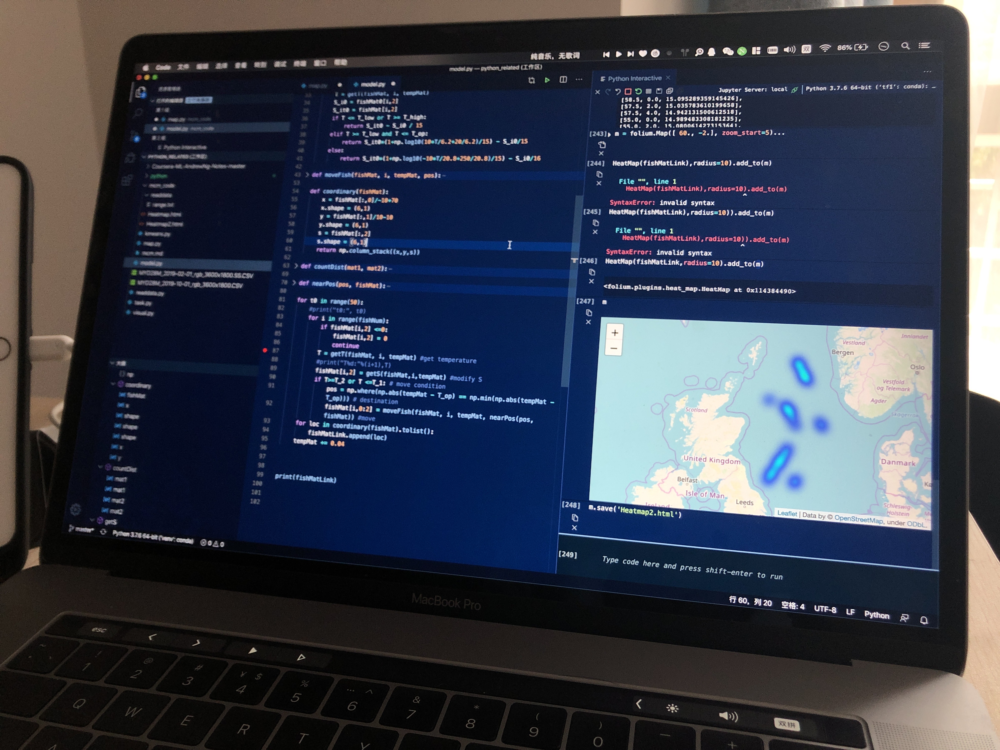

# 假期学习分享 & 线上学习规划

## 感触一：学习需要明确的目标

> 计算机相关专业对自学能力要求高
>
> 大家都熟悉课内学习的节奏，因此这里指 **课外** 学习

目标指的是什么呢？

- **项目**：大创、CITtrip...

- 比赛：信息安全竞赛、MCM...
  - 这个寒假我参加了美国大学生数学建模大赛，也开始了CITtrip深度学习相关项目的学习
- 

## 感触二：知识栈

来源与某次班会资料 [Learning-Materials](https://github.com/NETSEC-StudyGroup/Learning-Materials)

在为一个目标学习的过程，特别是在计算机相关的领域，会涉及到及其复杂的技术、软件知识，在学习过程中需要不断的发现问题，解决问题，这就是常说的递归学习法（笑

不断堆叠起来的这些知识技能，在我的理解里，就是`知识栈`

1. markdown：一种记笔记的简易程序语言
    - 文字记录为何不用 word？txt？
    - 插入链接
  
        [Learning-Materials](https://github.com/NETSEC-StudyGroup/Learning-Materials)
    - 记录代码
        ```py
        print('show me the code')
        ```
    - [格式排版](https://github.com/Steven147/python/blob/master/CITtrip.md#%E5%BA%94%E7%94%A8%E4%B8%80tensorflow-install)
  
2. vscode

   1. markdown文字编辑

   2. 代码编辑
      1. python / jupyter notebook
      2. C++
      3. Latex

这些看起来非常基础（可以但没必要啊），实际上为我节约了非常多的时间 [格式排版](https://github.com/Steven147/python/blob/master/CITtrip.md#%E5%BA%94%E7%94%A8%E4%B8%80tensorflow-install) 

## .

## .

## .

## .

## ***一句话概括：除了课程学习，应该找机会进行课外自学，最好结合项目资源进行实践，能切实提升自己***