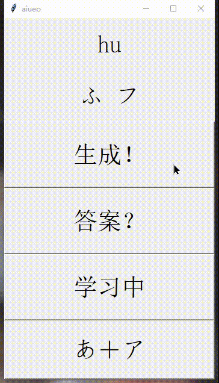
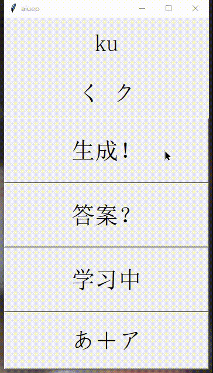
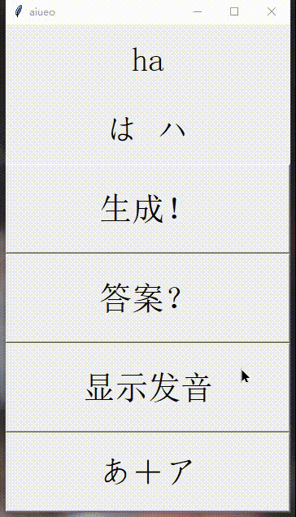
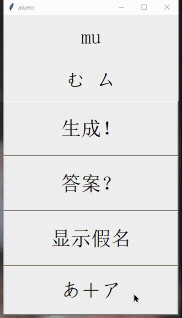

# 日语五十音学习软件 -- 设计文档

> by 林绍钦
> **卡片记忆单词法的简易程序模拟。**
> 核心思想：随机产生五十音进行辨识

- 交大云盘下载
  - Linux、macOS系统[下载](https://jbox.sjtu.edu.cn/l/snpjoV)
  - Windows系统[下载](https://jbox.sjtu.edu.cn/l/EnSEIq)

- Gihub途径下载
  - Linux、macOS系统[下载](https://github.com/Steven147/python/raw/master/%E6%97%A5%E8%AF%AD%E4%BA%94%E5%8D%81%E9%9F%B3%E5%AD%A6%E4%B9%A0/aiueo.zip)
  - Windows系统[下载](https://github.com/Steven147/python/raw/master/%E6%97%A5%E8%AF%AD%E4%BA%94%E5%8D%81%E9%9F%B3%E5%AD%A6%E4%B9%A0/aiueo.exe)


## 需求分析

<!-- 需求分析的具体内容可以归纳为五个方面：
- 软件的功能需求
- 软件与硬件或其他外部系统接口
- 软件的非功能性需求
- 软件的反向需求（哪些不能做）
- 软件设计和实现上的限制 -->

> 功能需求
<!-- > 描述软件的各种可能的条件下，对所有可能输入的数据信息，应完成那些具体功能，产生什么样的输出 -->

在大二下的日语选修课中修读了基础日语，需要在短时间内尽可能的熟练日语假名。虽然我之前接触过假名，但没有高效、完整的记忆过，存在许多漏洞：例如**对不常用的假名更陌生**、**对片假名更加陌生**、**根据发音默写假名**不如读出假名熟练。

这几个问题在语言学习上是共通的，根据以往的学习经验，我想起了卡片记忆法，原理就是通过将固定的词库记在一叠卡片上，随机的翻阅、记忆。这一方法用程序模拟能实现更灵活的功能，于是有了这一款简易的程序。

> 设计与实现限制：
<!-- 软件设计和实现上的限制主要指对软件设计者的限制。
- 软件运行环境的限制（选择计算机类型，使用配置，操作系统的限制等）
- 设计工具的限制（使用语言、执行的标准）
- 保密要求 -->

- 运行环境限制：
在Windows、Mac等桌面操作系统中运行，数据保存在程序数据库中直接调用，在本地运行，不需要联网。

- 设计工具限制
使用**Python**进行编写，通过**PyInstaller**进行打包。数据仅仅涉及字符，可以直接使用Python自带数据结构保存在程序源代码中。外包库涉及简易PythonGUI编写库**tkinter**。

> 软件与硬件或其它外部系统接口：

- 人机接口：<!-- 说明输入、输出的内容、屏幕安排、格式等要求； -->
  - 文本框：显示发音、假名
  - 按钮：使用若干按钮切换不同的显示模式
<!-- - 硬件接口：说明端口号，指令集，输入输出信号的内容与数据类型，初始化信号源，传输通道号和信号处理方式。 -->
- 软件接口：<!-- 说明软件的名称、助记符、规格说明、版本号和来源； -->
  - 图形界面库：[Python GUI 编程(Tkinter) | 菜鸟教程](https://www.runoob.com/python/python-gui-tkinter.html)
  - 可执行文件导出库：[pyinstaller使用方法 - 知乎](https://zhuanlan.zhihu.com/p/121566859)

<!-- cd C:\Users\lshq9\Documents\GitHub\python\2021\日语五十音学习\code\
pyinstaller -F aiueo_win.py   -->

<!-- - 通讯接口：指定通讯接口和通讯协议等描述。 -->

<!-- > 软件非功能性需求

指软件性能指标，容限等功能以外的需求。一般指下述内容：
时间需求：输入、输出频率，输入、输出响应时间，各种功能恢复时间等；
处理容限、精度、采样参数的分辨率，误差处理等；
可靠性的MTBF要求，可维护性、安全性要求等。 -->

> 性能需求

鉴于小程序功能相当简易，程序应尽可能实现迅速地开启与关闭，占用小，随开随用。

<!-- > 软件的反向需求
描述软件在那些情况下不能做什么。这一条是随软件实际要求而定。
有两类情形需要采用反向需求的形式。
第一种情况：某些用户需求适宜采用反向形式说明，如数据安全性要求属于这类形式。
第二种情况：对一些可靠性和安全性要求较高的软件，有些必须描述软件不能做些什么。如控制点火时序，我们必须交代清楚在那些情况下不能点火，否则会造成故障。 -->

<!-- - 交大云盘
  - 类Unix系统[下载](https://jbox.sjtu.edu.cn/l/snpjoV)（适用于Linux、macOS）
  - Windows系统[下载](https://jbox.sjtu.edu.cn/l/EnSEIq)

- Gihub途径
  - 类Unix系统[下载](https://github.com/Steven147/python/raw/master/%E6%97%A5%E8%AF%AD%E4%BA%94%E5%8D%81%E9%9F%B3%E5%AD%A6%E4%B9%A0/aiueo.zip)（适用于Linux、macOS）
  - Windows系统[下载](https://github.com/Steven147/python/raw/master/%E6%97%A5%E8%AF%AD%E4%BA%94%E5%8D%81%E9%9F%B3%E5%AD%A6%E4%B9%A0/aiueo.exe) -->


## 设计路线

> 结构设计：定义软件系统各主要部件之间的关系。

软件主体较少（百行左右），因此可以整合到同一个py文件。下面是源代码文件的模块结构，以及互相调用的关系。
程序首先利用tkinter扩展库生成了python-GUI对象；然后基于此对象的方法生成文本框、按钮等控件；接着编写逻辑函数，读取对应数据，处理为显示的数据，并且和控件绑定；最后在程序中循环运行窗口监听按钮操作，调用函数，修改文本显示内容。
```
aiueo.py
├──{} tkinter     ---library manager
├──[] variable    ---data initialize
│   ├── romaji
│   └── ...
├──{} botton      ---fuction defination
│   ├── botton1
│   └── ...
└──() mainloop    ---program entry
```
```py
#library manager 库文件导入
import tkinter

#data initialize 全局变量定义
romaji = ...

#fuction defination 函数定义，程序逻辑编写
def botton1():
    ...

#program entry 程序入口，程序窗口启动
#调用函数，调用库文件
if __name__ == "__main__":
    ...
    windows.mainloop() 
```

> 数据设计：将模型转换成数据结构的定义。

程序涉及到的数据量较小，下图基本包含了五十音学习的所有信息，包含平假名、片假名以及对应的发音。现有**Unicode**编码平假名、片假名储存。发音则以英文字符储存（日语习惯称为罗马字）。


将图片信息存入字符串与数组，数据结构如下：

```py
#平假名字符串
hiragana = """あいうえお
           かきくけこ
           さしすせそ
           たちつてと
           なにぬねの
           はひふへほ
           まみむめも
           やゆよ
           らりるれろ
           わをん"""
#片假名字符串
katakana = """アイウエオ
            カキクケコ
            サシスセソ
            タチツテト
            ナニヌネノ
            ハヒフヘホ
            マミムメモ
            ヤユヨ
            ラリルレロ
            ワヲン"""
#发音数组
romaji = ['a','i','u','e','o',
          'ka','ki','ku','ke','ko',
          'sa','si','su','se','so',
          'ta','chi','tsu','te','to',
          'na','ni','nu','ne','no',
          'ha','hi','hu','he','ho',
          'ma','mi','mu','me','mo',
          'ya','yu','yo',
          'ra','ri','ru','re','ro',
          'wa','wo','n']
```

> 接口设计：
<!-- 软件内部，软件和操作系统间以及软件和人之
间如何通信。 -->
软件图形界面根据常用的使用场景进行分析，最终界面中确定了两个文本框和四个按键。
- 控件设计：控件以图形界面展示的控件对应从上往下分别是
    - 文本框一：显示发音
    - 文本框二：显示假名
    - 按键一(`生成！`)：生成一个假名的罗马字表示
    - 按键二(`答案？`)：显示答案
    - 按键三(`学习中`...)：切换学习状态
      1. （`学习中`）状态下会始终显示罗马音和假名
      2. （`显示发音`）状态下只显示罗马音，按下（`答案？`）显示答案
      3. （`显示假名`）状态下只显示假名，按下（`答案？`）显示答案
    - 按键四(`あ＋ア`...)：切换假名显示
      1. (`あ＋ア`)显示平假名和片假名
      2. (`あ`)显示片假名
      3. (`ア`)显示平假名 
   @import "image2.png" 
- 控件代码定义
  控件定义使用tkinter规范，首先定义GUI窗口对象`windows`,然后使用label定义函数`tkinter.Label`定义两个文本框，使用button定义函数`tkinter.Button`定义四个按钮，按钮还要绑定四个逻辑函数`botton1` `botton2` `botton3` `botton4`
```py
#窗口初始化
windows = tkinter.Tk()
#文本框一初始化
l = tkinter.Label(textvariable = var,...)
l2 = tkinter.Label(textvariable = var2,...)
#文本框一初始化
b = tkinter.Button(text = '生成！', command=botton1,...)
b2 = tkinter.Button(text = "答案？", command=botton2,...)
b3 = tkinter.Button(textvariable = var3, command=botton3, ...)
b4 = tkinter.Button(textvariable = var4, command=botton4, ...)
```
> 过程设计：
<!-- 系统结构部件转换成软件的过程描述。 -->
学习过程可以抽象成不断循环随机生成**假名-发音对**的过程，通过按键一调用函数`botton1()`，生成指定范围内的随机数，可以根据随机数打印假名和发音。同时，学习和测试的需求不同，通过按键二调用函数`botton2()`，可以强制显示假名-发音对的所有内容，实现显示答案的效果。最后，根据需求需要定制显示的状态，通过按钮三调用`botton3()`切换（`学习中`）（`显示发音`）（`显示假名`）三个状态，通过按键四调用`botton4()`切换(`あ＋ア`)显示平假名和片假名、(`あ`)显示片假名、(`ア`)显示平假名三个状态。

```py
#botton1 按键一：生成一个假名的罗马字表示
def botton1():
    pass
    #生成随机数，根据随机数获取假名和发音数据
    #根据显示状态刷新文本框显示

#botton2 按键二：显示答案
def botton2():
    pass
    #强制文本框显示所有内容

#botton3 按键三：切换学习状态
def botton3():
    pass
    #修改学习状态变量的值
    #根据状态刷新文本框显示

#botton4 按键四：切换假名显示
def botton4():
    pass
    #修改显示状态变量的值
    #根据状态刷新文本框显示
```


## 使用流程实例

1. 首先不断点击(`生成！`)按键，可以随机浏览发音与对应的平假名、片假名。
 
2. 初步记忆后开始自测，点击（`学习中`）按钮，这时会切换到（`显示发音`），此时是对假名的测试，点击(`生成！`)生成新的发音，自行回忆发音对应的假名，如果对答案把握可以继续点击(`生成！`)，没有把握便可以点击(`答案？`)显示答案。
 
3. 根据发音记忆假名记忆完毕后，可以根据假名记忆发音，点击切换到（`显示假名`）状态，重复上面的记忆流程。
 
4. 同样，如果只需要记忆片假名，可以点击(`あ＋ア`)切换假名显示，继续重复上面的记忆流程。
 
5. 不断重复直到基本熟练所有的假名及对应发音。

<!-- ---

## 开发简记

### ~~下载途径其二（调试源代码）~~

1. 下载完整的repository文件，建议采用zip格式
2. 安装python
   - [python官方网站下载链接](https://www.python.org/downloads/)，按照步骤执行

   - 检查按照情况

      ```bash
      > python3 --version #检验是否安装python
      Python 3.7.2 #成功安装则返回版本
      ```

   - 在系统**命令行界面/终端**执行下列语句

      ```shell
      > python3 /.../aiueo.py #python3，空格，加上程序文件的路径（可将程序拖入命令行生成路径
      ``` -->

<!-- ### 程序具体实现步骤

- 已实现功能
  - 随机生成罗马音组合（随机数）
  - 显示罗马音对应平假名、片假名（列表）
  - 切换显示（判断逻辑）
- ~~待实现功能~~
  - ~~平假名、片假名字源信息显示~~

1. 五十音数据收集
2. 程序运行逻辑梳理，函数编写
   1. 按键一(NEW!)：随机生成 a k s t n h m y l w 与 a e u e o 组合
       - 特殊情况1: 在遇到没有对应名的音，则重新选择
       - 特殊情况2：ti -> chi
       - 特殊情况3：tu -> tsu
   2. 按键二(Answer?)：显示对应的平假名、片假名
   3. 按键三：开启始终显示/关闭始终显示
3. 交互实现 -->

## 源代码

@import ".\code\aiueo_win.py"