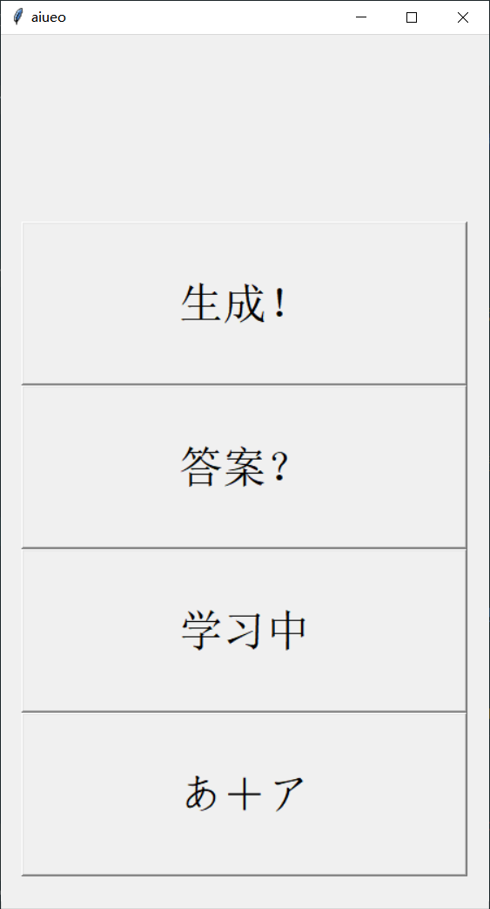

# 日语五十音学习软件

> 卡片记忆法的简易程序模拟。

在大二下的日语选修课中修读了基础日语，需要在短时间内尽可能的熟练日语假名。虽然我之前接触过假名，但没有高效、完整的记忆过，存在许多漏洞：例如**不熟练不常用的假名**、对**片假名更加陌生**、根据**发音默写假名**不如读出假名熟练。

这几个问题在语言学习上是共通的，根据以往的学习经验，我想起了卡片记忆法，原理就是通过将固定的词库记在一叠卡片上，随机的翻阅、记忆。这一方法用程序模拟能实现更灵活的功能，于是有了下面这一款简易的程序。

## 下载

- 交大云盘
  - 类Unix系统[下载](https://jbox.sjtu.edu.cn/l/snpjoV)（适用于Linux、macOS）
  - Windows系统[下载](https://jbox.sjtu.edu.cn/l/EnSEIq)

- Gihub途径
  - 类Unix系统[下载](https://github.com/Steven147/python/raw/master/%E6%97%A5%E8%AF%AD%E4%BA%94%E5%8D%81%E9%9F%B3%E5%AD%A6%E4%B9%A0/aiueo.zip)（适用于Linux、macOS）
  - Windows系统[下载](https://github.com/Steven147/python/raw/master/%E6%97%A5%E8%AF%AD%E4%BA%94%E5%8D%81%E9%9F%B3%E5%AD%A6%E4%B9%A0/aiueo.exe)

## 功能

### ***核心思想：随机产生五十音进行辨识***

1. 按键一(`生成！`)：生成一个假名的罗马字表示

2. 按键二(`答案？`)：显示答案

3. 按键三(`学习中`，`显示发音`，`显示假名`)：切换状态
   1. （`学习中`）状态下会始终显示罗马音和假名
   2. （`显示发音`）状态下只显示罗马音，按下（`答案？`）显示答案
   3. （`显示假名`）状态下只显示假名，按下（`答案？`）显示答案

4. 按键四：切换假名显示
    1. (`あ＋ア`)显示平假名和片假名
    1. (`あ`)显示片假名
    1. (`ア`)显示平假名 



## 使用流程实例

1. 首先不断点击(`生成！`)按键，可以随机浏览发音与对应的平假名、片假名。
1. 初步记忆后开始自测，点击（`学习中`）按钮，这时会切换到（`显示发音`），此时是对假名的测试，点击(`生成！`)生成新的发音，自行回忆发音对应的假名，如果对答案把握可以继续点击(`生成！`)，没有把握便可以点击(`答案？`)显示答案。
1. 根据发音记忆假名记忆完毕后，可以根据假名记忆发音，点击切换到（`显示假名`）状态，重复上面的记忆流程。
1. 同样，如果只需要记忆片假名，可以点击(`あ＋ア`)切换假名显示，继续重复上面的记忆流程。
1. 不断重复直到基本熟练所有的假名及对应发音。

---

## 以下是我的絮絮叨叨

>给需要的朋友提供源代码分析途径

### ~~下载途径其二（调试源代码）~~

1. 下载完整的repository文件，建议采用zip格式
2. 安装python
   - [python官方网站下载链接](https://www.python.org/downloads/)，按照步骤执行

   - 检查按照情况

      ```bash
      > python3 --version #检验是否安装python
      Python 3.7.2 #成功安装则返回版本
      ```

   - 在系统**命令行界面/终端**执行下列语句

      ```shell
      > python3 /.../aiueo.py #python3，空格，加上程序文件的路径（可将程序拖入命令行生成路径
      ```

### 程序具体实现步骤

- 已实现功能
  - 随机生成罗马音组合（随机数）
  - 显示罗马音对应平假名、片假名（列表）
  - 切换显示（判断逻辑）
- ~~待实现功能~~
  - ~~平假名、片假名字源信息显示~~

1. 五十音数据收集
2. 程序运行逻辑梳理，函数编写
   1. 按键一(NEW!)：随机生成 a k s t n h m y l w 与 a e u e o 组合
       - 特殊情况1: 在遇到没有对应名的音，则重新选择
       - 特殊情况2：ti -> chi
       - 特殊情况3：tu -> tsu
   2. 按键二(Answer?)：显示对应的平假名、片假名
   3. 按键三：开启始终显示/关闭始终显示
3. 交互实现
